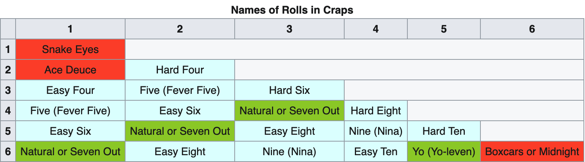

# Dice Game

## Setup
- Fork this repository by clicking the "Fork" button (top-right corner of the remote repo)
- Clone the *new* repository to your local machine
	- From the command line: `git clone {the-forked-page-url}`

## Part 1: Variables, functions and elements

### Steps
1. Complete the steps in the HTML document to build a prototype interface for a dice game 
	- See [index.html](./index.html) for an example interface written within a comment block
2. Call `getRandomDiceRoll()` and store the result as a variable named `diceRoll`
3. Update user interface (`document`), showing the dice face (svg image) that matches the roll number
4. Use `diceRoll` to update the label "You rolled: #" (replacing # with the roll)
5. Wrap the dice roll procedure in a function named `rollTheDice()`, call it from the `console` to test
6. Listen for a `click` to happen to the `<button>`, then callback to the function `rollTheDice`

### Tips
- Before starting, consider using the browser's developer tools to prototype a solution manually
	- Start by changing the document from the "Elements" tab to go from a *roll 3* to *roll 4*
- Next, consider prototyping within JS by assigning a number to `diceRoll` before getting a random
	- This will assist by creating a controlled case before assigning a random value
- Use the console to test each line of code that affects the document, as you code
	- Mis-selecting elements will create errors that prevent the page from working as intended

## Part 2: Control statements (conditions)

Complete these challenge exercises to enforce your understand of control statements:

1. Develop the necessary condition statements to allow the roll number to be expressed as a word
	- For example, _"You rolled: **3**"_ should be _"You rolled: **three**"_
2. Keep track of the previous roll value, such that if the same number is rolled twice consecutively, the output message will notify the user appropriately
	- For example, _"You rolled **another** three"_
3. Add a second dice to the application interface to mimic the results of the popular casino game, ["craps"](https://en.wikipedia.org/wiki/Craps). Replace the result message (*"Your rolled: ____"*) with the appropriate roll outcome based on the table below, reflecting the result of rolling both dice together
	
